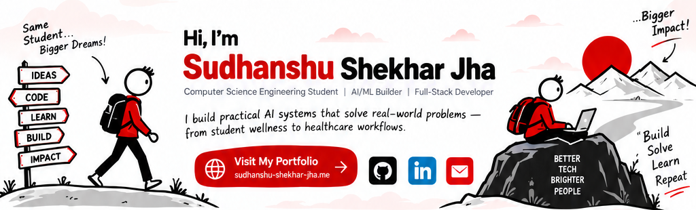

<div align="center">



<br/><br/>

[](https://sudhanshu-shekhar-jha.me)
[](https://github.com/sudhanshu25099-code)
[](https://www.linkedin.com/in/sudhanshu-shekhar-jha-b0aaa9377/)
[](mailto:sudhanshushekharjha2007@gmail.com)


</div>

---

## 💡 About Me

I'm a **Computer Science Engineering student** focused on turning ideas into working software.

My interests sit at the intersection of:

- 🤖 **Artificial Intelligence & Generative AI**
- 🧠 **NLP & LLM Applications**
- 🌐 **Full-Stack Web Development**
- 🏥 **Healthcare Technology & Digital Health**
- 🗄️ **Database Systems**
- ⚡ **Hackathons, rapid prototyping & product building**

I enjoy taking a problem from **"What if we built this?"** to a functional prototype that people can actually interact with.

> **My goal:** build technology that is not only technically interesting, but genuinely useful.

---

## 🧠 What I'm Building

### 🌿 Student Wellness App

An AI-driven student wellness and early-support platform designed to make support more accessible for students.

**Highlights**
- Conversational AI powered by **Llama 3.3 + Groq**
- Natural Language Processing for student input
- Crisis-signal detection and support routing
- Secure authentication and session management
- SQLAlchemy-based data layer
- SQLite for development with a path toward PostgreSQL
- Lightweight frontend using Vanilla JavaScript and Tailwind CSS
- Wellness tracking, support resources and guided breathing interactions

🔗 **Live Demo:** [student-wellness-app.onrender.com](https://student-wellness-app.onrender.com)
🔗 **Repository:** [sudhanshu25099-code/student-wellness-app_GFG26](https://github.com/sudhanshu25099-code/student-wellness-app_GFG26)

---

### 🏥 AI Clinical Intake Platform

A multimodal clinical intake system aimed at reducing OPD overcrowding by collecting and structuring patient information before consultation.

**Highlights**
- 🎙️ Voice-first patient history acquisition
- 🤖 Gemini-powered conversational AI
- 🗣️ Natural-language → structured clinical history
- 📄 OCR for prescriptions and laboratory reports
- 🧠 Document intelligence / entity extraction
- 🔗 ABDM-aligned **FHIR R4** interoperability
- ⚡ React + TailwindCSS frontend
- 🐍 Python + FastAPI backend

> **The broader vision is simple:** collect better information before the consultation so clinicians can spend more time on care.

---

## 🛠️ Technical Skills

### Languages


### AI / ML


### Web & Backend


### Databases & Data


### Tools & Platforms


---

## 📊 GitHub Stats

<div align="center">


</div>

---

## 🎯 Current Focus

I'm currently working on becoming stronger across the complete AI application stack:

```text
Problem
   ↓
Research & Understanding
   ↓
Data / NLP / LLM
   ↓
Backend & APIs
   ↓
Database
   ↓
Frontend
   ↓
Deployment
   ↓
Real-World Product
```

I'm particularly interested in learning how to move beyond simple AI demos and build **reliable, deployable, user-focused AI applications**.

---

## 🧩 How I Like to Build

I care about three things:

### 01 — Solve the problem
Technology comes after understanding the user and the actual bottleneck.

### 02 — Build fast, then improve
I like prototyping quickly, testing assumptions, and iterating based on what works.

### 03 — Learn by shipping
Every project is an opportunity to learn a new API, architecture, framework, database concept, or deployment workflow.

---

## 🏆 What You'll Find on My GitHub

```text
AI / LLM Applications
├── NLP
├── Prompt Engineering
├── Conversational AI
├── Document Intelligence
└── Multimodal AI

Software Development
├── Python
├── Flask / FastAPI
├── React
├── APIs
└── Full-Stack Applications

Computer Science
├── DBMS
├── SQL
├── Data Structures & Algorithms
└── Software Engineering
```

---

## 📈 My Learning Philosophy

> **Don't just learn technologies. Learn how to use them to build things that matter.**

I'm continuously improving through projects, hackathons, experimentation, and hands-on development.

There is a lot more I want to learn — and that's exactly what makes building exciting.

<br/>

<div align="center">

## 🤝 Let's Connect

I'm always interested in connecting with people who are passionate about **AI, software engineering, hackathons, open source, healthcare technology, and building useful products.**

[](https://sudhanshu-shekhar-jha.me)
[](https://github.com/sudhanshu25099-code)
[](https://www.linkedin.com/in/sudhanshu-shekhar-jha-b0aaa9377/)
[](mailto:sudhanshushekharjha2007@gmail.com)

### 🌟 Build. Break. Learn. Improve. Repeat.

**Thanks for visiting my profile!**


</div>
