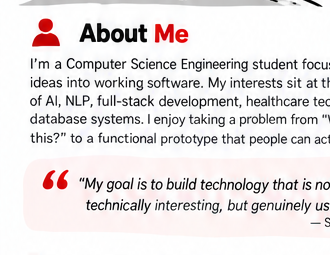
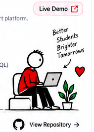
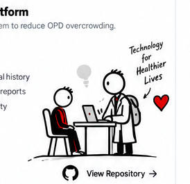
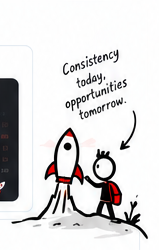
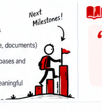

<!--
GITHUB PROFILE SETUP:
Upload this README.md AND all PNG files in this package to the root of your
profile repository (sudhanshu25099-code). Keep the filenames unchanged.
-->
<div align="center">

<a href="https://sudhanshu-shekhar-jha.me/">
  
</a>

<p>
  <a href="https://sudhanshu-shekhar-jha.me/"></a>
  <a href="https://github.com/sudhanshu25099-code"></a>
  
</p>

### Computer Science Engineering Student · AI/ML Builder · Full-Stack Developer

> **I build practical AI systems that turn real-world problems into useful products.**

</div>

---

## 👋 About Me

<table>
<tr>
<td width="62%" valign="top">

I'm a **Computer Science Engineering student** focused on turning ideas into working software.

My interests sit at the intersection of **AI/Generative AI, NLP & LLMs, full-stack development, healthcare technology, and database systems**.

I enjoy taking a problem from **“What if we built this?”** to a prototype people can actually interact with — then improving it through testing, iteration, and shipping.

> **My goal:** build technology that is not only technically interesting, but genuinely useful.

</td>
<td width="38%" align="center" valign="middle">

</td>
</tr>
</table>

## 💡 What I Do

| 🤖 AI & GenAI | 🧠 NLP & LLMs | 🌐 Full-Stack | 🏥 Digital Health |
|---|---|---|---|
| LLM apps, prompting, AI workflows | Conversational systems, extraction | React, JS, Flask, FastAPI | Clinical workflows & interoperability |

| 🗄️ Databases | ⚡ Prototyping | 🧩 Open Source | 🎯 Problem Solving |
|---|---|---|---|
| SQL, MySQL, PostgreSQL, SQLite | Hackathons & rapid builds | Collaboration & GitHub | From bottleneck → working product |

---

## 🚀 Featured Projects

<table>
<tr>
<td width="50%" valign="top">

### 🌿 Student Wellness App

An AI-driven student wellness and early-support platform designed to make support more accessible for students.

**Core stack**

`Llama 3.3` · `Groq` · `Python` · `Flask` · `SQLAlchemy` · `SQLite` · `JavaScript` · `Tailwind CSS`

**Highlights**

- Conversational AI for student interactions
- NLP over student input
- Crisis-signal detection and support routing
- Secure authentication and session management
- Wellness tracking, resources and guided breathing

<a href="https://student-wellness-app.onrender.com">🔴 Live Demo</a> · <a href="https://github.com/sudhanshu25099-code/student-wellness-app_GFG26">💻 Repository</a>

</td>
<td width="50%" align="center" valign="middle">

</td>
</tr>

<tr>
<td width="50%" align="center" valign="middle">

</td>
<td width="50%" valign="top">

### 🏥 AI Clinical Intake Platform

A multimodal clinical intake system aimed at reducing OPD overcrowding by collecting and structuring patient information before consultation.

**Core stack**

`React` · `Tailwind CSS` · `Python` · `FastAPI` · `Gemini API` · `OCR` · `FHIR R4`

**Highlights**

- Voice-first patient history acquisition
- Gemini-powered conversational AI
- Natural language → structured clinical history
- OCR for prescriptions and laboratory reports
- Document intelligence and entity extraction
- ABDM-aligned FHIR R4 interoperability

</td>
</tr>
</table>

> **Build principle:** collect better information before the workflow bottleneck so people can spend more time on the work that matters.

---

## 🛠️ Tech Stack

### Languages

    

### AI / ML

    

### Web & Backend

   

### Data

   

### Tools

  

---

## 📊 GitHub Activity

<div align="center">

<a href="https://github.com/sudhanshu25099-code">
  
</a>
<a href="https://github.com/sudhanshu25099-code">
  
</a>

<br>


</div>

<table>
<tr>
<td width="50%" align="center"></td>
<td width="50%" valign="middle">

### 📈 Keep Shipping

```text
Problem
  ↓
Research
  ↓
AI / NLP / LLM
  ↓
Backend + Database
  ↓
Frontend
  ↓
Deployment
  ↓
Real-World Product
```

</td>
</tr>
</table>

---

## 🎯 Current Focus

- Building end-to-end AI applications instead of isolated demos
- Exploring multimodal AI across **text, voice and documents**
- Strengthening system design, databases and deployment
- Learning how to make AI systems more reliable and user-focused
- Contributing to meaningful projects, hackathons and open-source work

## 🧩 How I Build

**01 — Understand the problem** → start with the user, workflow and bottleneck.

**02 — Build fast, then improve** → prototype, test assumptions, iterate.

**03 — Learn by shipping** → every build teaches architecture, APIs, data, UX or deployment.

---

## 💭 Learning Philosophy

<div align="center">

> **Don't just learn technologies. Learn how to use them to build things that matter.**

</div>

<table>
<tr>
<td width="50%" valign="top">

### 🏆 What You'll Find Here

```text
AI / LLM
├── NLP
├── Prompt Engineering
├── Conversational AI
├── Document Intelligence
└── Multimodal AI

Software Development
├── Python
├── Flask / FastAPI
├── React
├── APIs
└── Full-Stack Applications

Computer Science
├── DBMS
├── SQL
├── Data Structures & Algorithms
└── Software Engineering
```

</td>
<td width="50%" align="center" valign="middle">

</td>
</tr>
</table>

---

## 🤝 Let's Connect

<div align="center">

<a href="https://sudhanshu-shekhar-jha.me/"></a>
<a href="https://github.com/sudhanshu25099-code"></a>

I'm interested in **AI, software engineering, hackathons, open source, healthcare technology, and useful products.**

### 🌟 Build. Break. Learn. Improve. Repeat.

</div>

<a href="https://sudhanshu-shekhar-jha.me/"></a>

<div align="center">

**Thanks for visiting my profile!** ❤️

</div>
